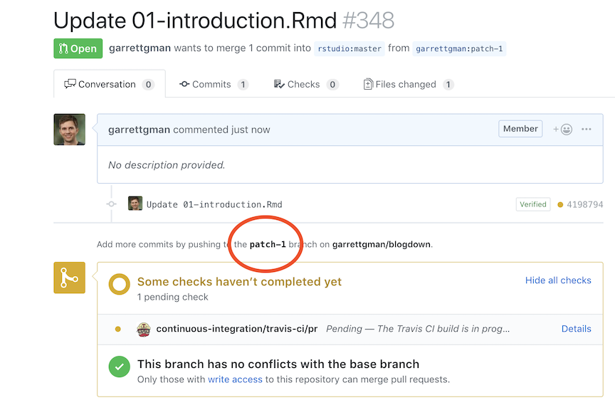

---
output:
  html_document:
    css: air.css
---

# Pull Requests

To add a recipe or fix a typo in the Tidyverse cookbook, use a pull request. Here's how: 

## Make a pull request

1. Visit the chapter of the [Tidyverse cookbook](https://rstudio-education.github.io/tidyverse-cookbook/program.html) that you wish to edit. 

1. Click the icon at the top of the page that looks like this . 

1. If prompted, click the green "Fork this repository and propose changes" button, which looks like this: 

    ```{r echo = FALSE, out.width="75%"}
    knitr::include_graphics("img/fork.png")
    ```
    
    This will open an editable copy of the chapter file.
    
1. Make your changes to the file. If you are adding a recipe, try to match the [R Markdown formatting](https://rmarkdown.rstudio.com/lesson-1.html) that you see in the other recipes. Realize that your text may be edited later; this is not personal---in fact, it is a luxury.

1. Scroll down to the Propose file change box, which looks like this:

    ```{r echo = FALSE, out.width="75%"}
    knitr::include_graphics("img/wizard.png")
    ```
    
    Describe your changes and click "Propose file change."
    
1. When prompted, click the green "Create pull Request button, which looks like this:

    ```{r echo = FALSE, out.width="75%"}
    knitr::include_graphics("img/create.png")
    ```
    
1. When the box below appears, add this message to your pull request: `CC BY 4.0`. This applies the [Creative Commons 4.0 International License](https://creativecommons.org/licenses/by/4.0/) to your changes, which is required to maintain a uniform license for the book. Then click "Create Pull Request."
    
    ```{r echo = FALSE, out.width="75%"}
    
    ```
    
Congratulations! You have submitted your pull request. Github will ping me and I'll review your edits. 

## Update a pull request

If I ask you to make changes, you will need to update your pull request. To do this:

1. Visit the webpage for your pull request. It will be listed [here](https://github.com/rstudio-education/tidyverse-cookbook/pulls).

1. Click the name of the branch associated with your pull request. It will be in the spot circled below.
    
    ```{r echo = FALSE, out.width="75%"}
    
    ```
    
1. Navigate to the file you need to change.

1. Click the edit icon at the top of the file to open an editable version of the file. The icon is circled below.

    ```{r echo = FALSE, out.width="75%"}
    knitr::include_graphics("img/edit.png")
    ```
    
1. Make your changes.

1. Scroll down to the Commit changes box, which looks like this:
    
    ```{r echo = FALSE, out.width="75%"}
    
    ```
    
    Describe your changes and click "Commit Changes."
    
    Congratulations! Your changes will be automatically added to your pull request. They will appear as a second, third, etc. commit on your pull request page:
    
    ```{r echo = FALSE, out.width="75%"}
    knitr::include_graphics("img/appear.png")
    ```


